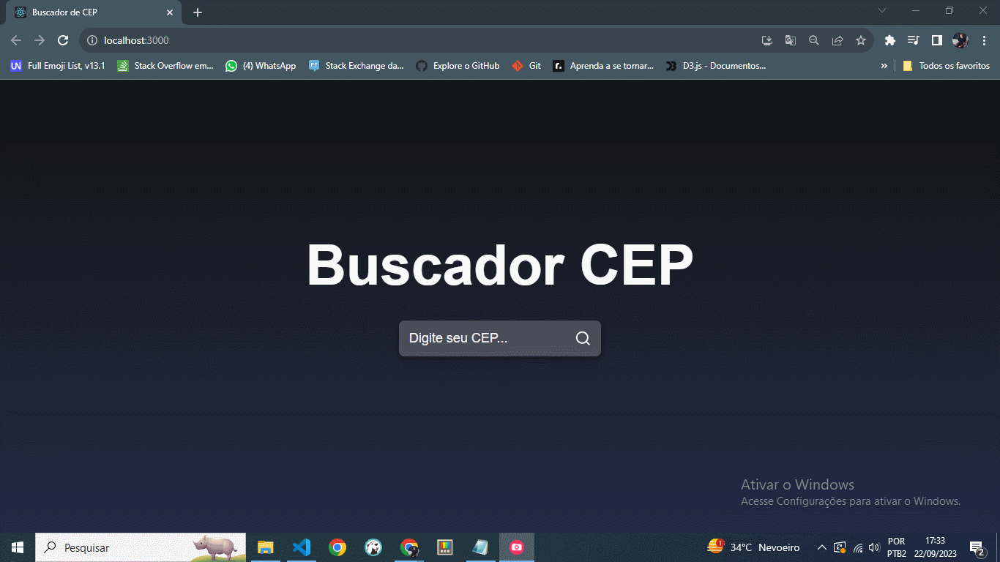

# 📫 Consulta de CEP com React e Axios na API ViaCEP

Este é um aplicativo React simples que utiliza a biblioteca Axios para consultar informações de um CEP usando a API do ViaCEP. Permite aos usuários inserirem um CEP e, ao submeterem o formulário, obterem as informações relacionadas a esse CEP.

## Funcionalidades

- Insira um CEP no campo de entrada.
- Ao enviar o formulário, as informações do CEP são exibidas.

## Como Executar o Aplicativo

1. Certifique-se de ter o Node.js instalado em seu ambiente.
2. Clone este repositório.
3. Instale as dependências usando `npm install`.
4. Inicie o aplicativo com `npm start`.
5. Acesse o aplicativo em http://localhost:3000 no seu navegador.

## 🛠 Ferramentas

- [REACT](https://react.dev/)
- [NODE](https://nodejs.org/)
- [CSS](https://developer.mozilla.org/pt-BR/docs/Web/CSS)
- [AXIOS](https://axios-http.com/ptbr/docs/intro)
- [ViaCEP](https://viacep.com.br/)

## Contribuição

Se você tem alguma Sugestão enviar para devandersonmotta@gmail.com com o assunto: "contribuição reactCEP" ou entre em contato pelo Linkedin.

## Licença

MIT

## ✉ Contato

email: devandersonmotta@gmail.com

linkedin: www.linkedin.com/in/anderson-motta-96b138235
---

## 💡 Objetivo

Praticar os conceitos do REACT e interagir com API's. 

